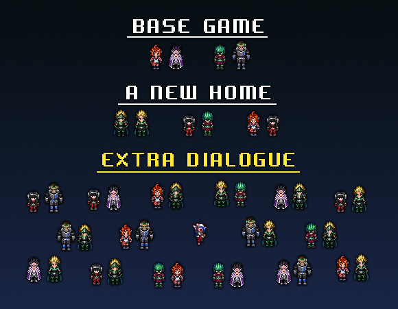
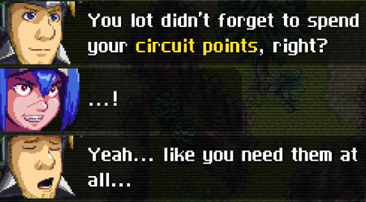
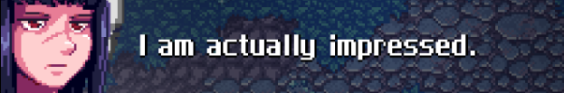

This mod adds more lore-friendly dialogues for party members, that previously had none. 

New interactions increase amount of post-combat party banter by **at least 4 times**, when compared to original game + DLC.

*Note: 'A New Home' DLC is NOT required, although majority of new content is only available in post-game.*

## Installation
This mod requires [CCLoader](https://github.com/CCDirectLink/CCLoader) which you can either install manually or use the [CCLoader installer](https://github.com/CCDirectLink/ccloader-installer).

Once CCLoader is installed, [download a release](https://github.com/keanuplayz/CCExtraDialogue/releases) of CCExtraDialogue and put it into `CrossCode/assets/mods`.

# Extended Party Dialogue

*CrossCode: Extra Dialogue* features new dialogue for **16 different parties**, which were not covered by the original game. 

Numbers say it all. The mod adds approximately 7500 words of text, which is almost a size of novelette!

We paid extra attention to keeping new dialogues lore-friendly and true to characters personalities, while also making them interesting and expanding a little bit on the world of CrossCode.

Just like in the original game, new dialogues play out after finishing combat.

# Additional features
## Reactive Banter

Party dialogue may have subtle changes based on which other dialogues have already played out, how certain past events have unfolded, active NG+ modifiers and even your personal stats, like current level.

## Extended Miscellaneous Banter

We added a few extra lines for miscellaneous events to characters, that had the least amount of them.

It mostly concerns equipment upgrade and finishing combat with S rank.

## Custom Expressions

This mod utilizes new custom expressions, provided by [Extra Expressions Pack](https://github.com/Paradragon/cc-extra-expressions-pack/). 

This pack is already integrated. **You don't have to download it manually.** 

# Other
## Other languages
*CrossCode: Extra Dialogue* features only English translation. We have no plans for implementing translations for other languages ourselves.

If you want to contribute by implementing a translation to different language, we're open to pull requests.

## Compatibility
This mod should have no conflicts and is safe to use with any other mod, big or small.

## Uninstall
*CrossCode Extra Dialogue* can be safely disabled or uninstalled at any point without detrimental effects on your save file.

## Contacts
If you have questions or want to report an issue, join our [Discord server]().